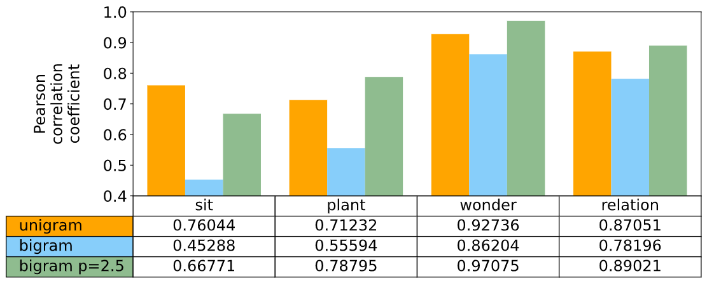
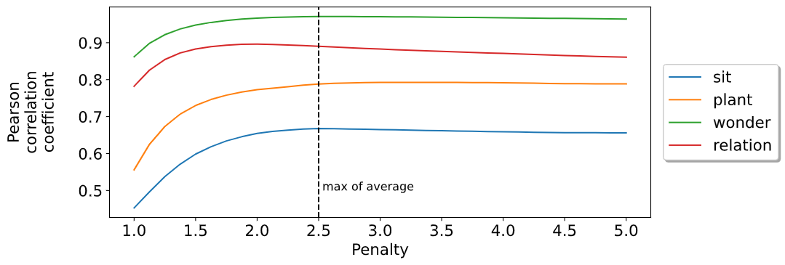
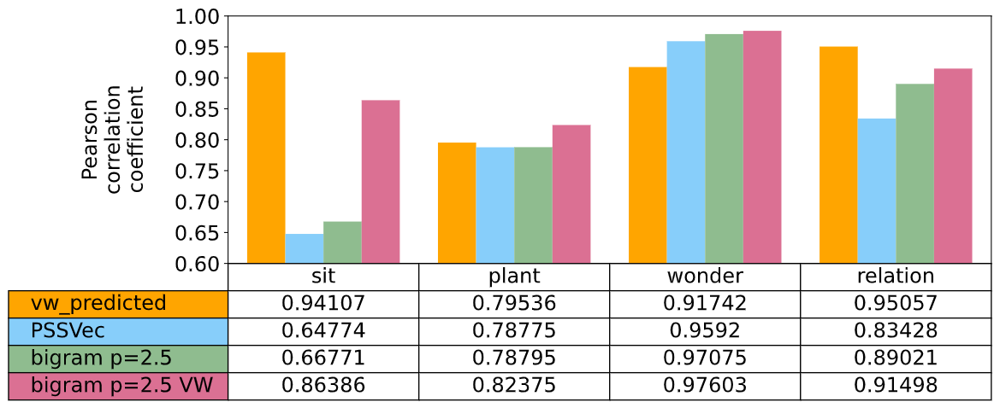
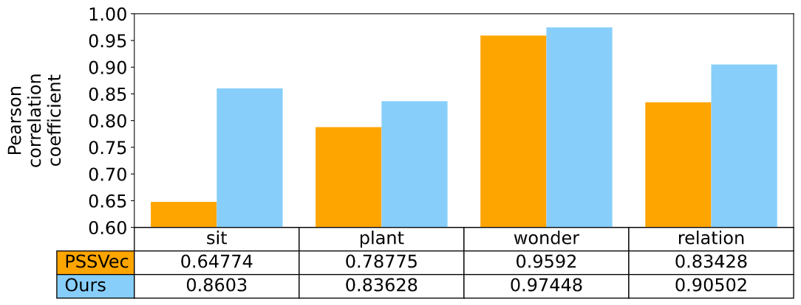

# Phonetic Word Similarity

A novel method to compare the phonetic similarity between words based on phonetic features.

- [Phonetic Word Similarity](#phonetic-word-similarity)
  - [Preparing dataset and environment](#preparing-dataset-and-environment)
    - [Downloading](#downloading)
    - [Preparing](#preparing)
  - [Algorithm results](#algorithm-results)
  - [Train embedding](#train-embedding)
  - [Embedding results](#embedding-results)
  - [License](#license)
  - [Acknowledgments](#acknowledgments)

---

## Preparing dataset and environment

### Downloading

Download [The CMU Pronouncing Dictionary](http://www.speech.cs.cmu.edu/cgi-bin/cmudict) in the data directory.

```
wget -P data http://svn.code.sf.net/p/cmusphinx/code/trunk/cmudict/cmudict-0.7b
```

Download SOTA model vocab from [NLP for Hindi git repo](https://github.com/goru001/nlp-for-hindi).

```
wget -O data/hindi_lm_large.vocab https://drive.google.com/uc?export=download&id=1P6r8UBcegvVmr1kBDjqcYppmt_WgnbNt
```

### Preparing

Add missing words to cmu dictionary

```
cat data/cmudict-0.7b res/cmudict_missing_words >> data/cmudict-0.7b-with-vitz-nonce
```

Install all the dependencies.

```
pip install -r src/requirements.txt
```

Generate hindi dictionary from LM vocab

```
python src/preprocess/vocab2dict.py res/hindi_phones.csv data/hindi_lm_large.vocab data/dict_hindi
```

---

## Algorithm results

[results_method.ipynb](src/results_method.ipynb) contains results for the algorithm. The result includes:

Comparision between unigram, bigram and bigram with penalty.


How we obtained the penalty of 2.5.


Comparision between [Vitz and Winkler (1973)](https://www.researchgate.net/publication/232418589_Predicting_the_Judged_Similarity_of_Sound_of_English_words), [Parrish's Embeddings (2017)](https://aaai.org/ocs/index.php/AIIDE/AIIDE17/paper/view/15879), and our methods (with and without vowel weights).



^ The Parrish's Embeddings (PSSVec) results are generated from the author's provided git [code](https://github.com/aparrish/phonetic-similarity-vectors) using `numpy.seed(0)`.

---

## Train embedding

* [English Embedding](embedding_english/)
* [Hindi Embedding](embedding_hindi/)

---

## Embedding results



---

## License

This project is licensed under the MIT License - see the [LICENSE](LICENSE) file for details

## Acknowledgments

* Hat tip to anyone whose code was used
