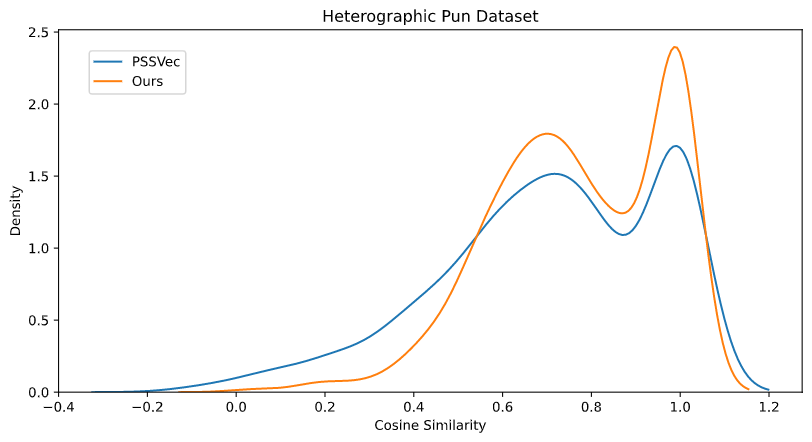
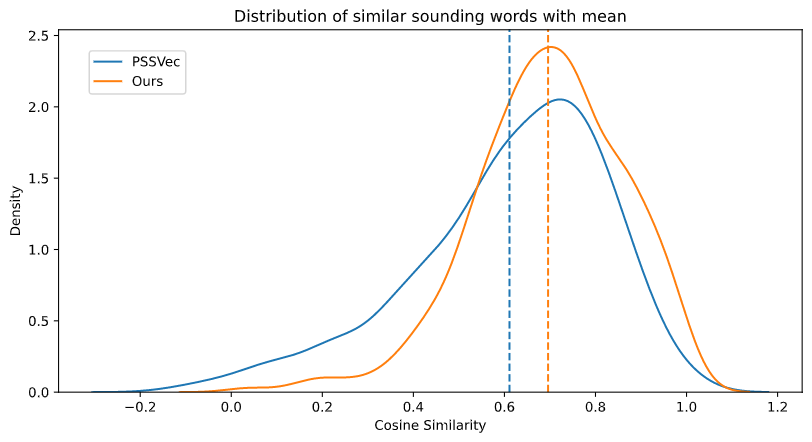

# Pun

## Background

A pun is a form of wordplay which exploits the different possible meanings of a word or the fact that there are words that sound alike but have different meanings, for an intended humorous or rhetorical effect. The first category where a pun exploiting the different possible meanings of a word is called `Homographic pun` and the second one that exploits the similar sounding words is called `Heterographic pun`.

An example of a Heterographic pun is:

    I Renamed my iPod The Titanic, so when I plug it in, it says “The Titanic is syncing.”

Here the word `syncing` is similar sounding to the word `sinking`.

## Dataset

We have used [SemEval-2017 Task 7 (Detection and Interpretation of English Puns)](http://alt.qcri.org/semeval2017/task7/) dataset. Which consists of three subtasks. The 3rd subtask dataset contains word pairs for 1098 hetrographic puns (data/test/subtask3-heterographic-test.gold). That contains word-pairs like `syncing` and `sinking` i.e. what is present and what it is representing. For a hetrographic pun to work these words should be similar sounding. So, we have taken all the word pairs that are present in [CMU Dictionary](http://www.speech.cs.cmu.edu/cgi-bin/cmudict) and removed all the duplicate pairs. This gives us 778 word pairs present in [heterographic_pun_words.txt](../res/heterographic_pun_words.txt).

## Results

To compare our phonetic embedding with [Parrish's Embeddings (2017), PSSVec](https://aaai.org/ocs/index.php/AIIDE/AIIDE17/paper/view/15879) we need to download their embeddings.

```
wget -P data https://github.com/aparrish/phonetic-similarity-vectors/raw/master/cmudict-0.7b-simvecs
```

Now, we can run [src/puns.ipynb](../src/puns.ipynb) to get these results.



Our curve is tighter than PSSVec. Most word pairs have exact same phonemes (Homophones), that is why most of them are 1 (spike in the density at 1).

If we remove all the homophone pairs then we are left with 583 pairs.



As we can see our distribution more closely resembles gaussian with tighter curve and better mean.

These are some of the scores sorted by the diff (diff = Ours - PSSVec).

|   word1 |   word2 |    PSSVec |     Ours |      diff |
|--------:|--------:|----------:|---------:|----------:|
|  mutter |  mother | -0.012362 | 0.899352 |  0.911714 |
|    loin |   learn | -0.088541 | 0.811977 |  0.900518 |
| truffle | trouble |  0.136548 | 0.962972 |  0.826425 |
|    soul |    sell |  0.073892 | 0.764270 |  0.690379 |
|    sole |    sell |  0.073892 | 0.760572 |  0.686680 |
|     ... |     ... |       ... |      ... |       ... |
|   eight |     eat |  0.719679 | 0.435228 | -0.284451 |
|  allege |   ledge |  0.714921 | 0.417235 | -0.297686 |
|    ache |     egg |  0.773436 | 0.458007 | -0.315429 |
|  engels |   angle |  0.831800 | 0.498631 | -0.333169 |
| bullion |    bull |  0.781468 | 0.412887 | -0.368581 |

Even in the worst case our embedding are different by much (at max 0.36). But PSSVec is not working good in top cases.

    MUTTER -> M AH1 T ER0
    MOTHER -> M AH1 DH ER0

Despite being differed by only one phoneme PSSVec is not giving good results. A low score of `-0.012362` can be majorly attributed to the set of cross-features based method as even before the PCA score was only 0.28. Also, due to PCA their range is not strictly between [0, 1].